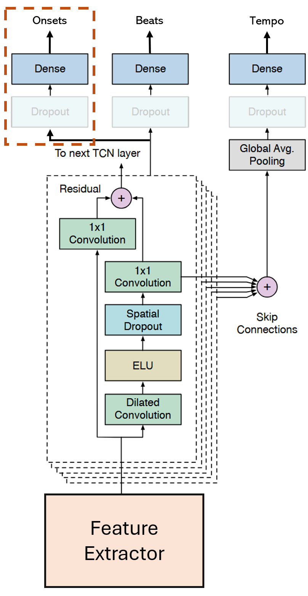

# AnMP Challenge - Onset, Beat, and Tempo Detection

**Bank JUHASZ | SS2025**

---

## Introduction

The Three-Headed Dragon for beat, onset, and tempo predictions for the Audio and Music Processing Course Challenge of 2025.

## Architecture

My goal was to create a single competent model for all three tasks with a separate task head for each target. The final
architecture relies heavily on the [Multi-Task Learning of Tempo and Beat: Learning One to Improve the Other](https://archives.ismir.net/ismir2019/paper/000058.pdf)
paper by Böck et al. (2019) and combines it with novel ideas from [Beat This! Accurate Beat Tracking Without DBN Postprocessing](https://arxiv.org/pdf/2407.21658)
by Foscarin et al. (2024).

<figure>
    
    <figcaption>Modified model architecture from Böck et al. (2019)</figcaption>
</figure>

## Todos
- [x] loading masks for extra datasets
- [x] data augmentation:
  - [x] pitch shifting
  - [x] tempo manipulation
  - [x] random cropping
- [x] DBN
- [ ] command line interface
- [ ] experiment with partial transformer layers

## Results

| Task   | Score | Rank |
|:-------|------:|-----:|
| Onsets |  0.79 |  3rd |
| Beats  |  0.91 |  1st |
| Tempo  |  0.95 |  1st |

## Usage

The training script assumes precomputed spectrograms (and their augmented forms) under `data`. Raw audio files can be 
processed using `preprocessing.py`. Training can be started by running `training.py`. All hyperparameters must be
changed in there, or in `loss.py`, `model.py`, `postprocessing.py`.

Were this a published work, this would obviously be much more tidy. The challenge deadline and the small scale of the 
project allowed for less future proofing, so the code is not very modular.

As for making predictions, `inference.py` is relatively straightforward. There is also no CLI here, but all it needs is
`ckpt_name` under `if __name__ == '__main__':` to select the desired model in the `checkpoints` folder. This script
creates a joint prediction json file in the required format, and saves it under `predictions`.

## Potential Issues

A small caveat is the `madmom` package, which was devilishly difficult to make work on WSL. If one manages to install
_any_ working version of it, the script will run successfully, but I had to install a very specific, non-official
version which fixed a specific dependency issue. In case of issues relating to this, please try to use [this](https://github.com/CPJKU/madmom/pull/548/files).